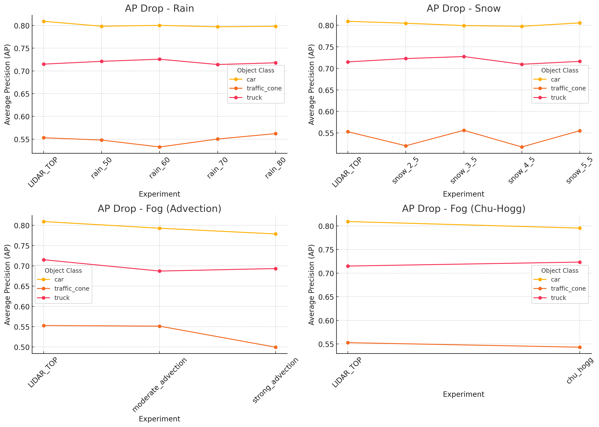

# BEVFusion Evaluation on Weather-Augmented NuScenes using MMDetection3D

## 📌 Project Overview

This project evaluates the **BEVFusion** model's performance under different weather conditions using the **nuScenes mini** dataset. The core idea is to assess how robust BEVFusion is when exposed to adverse weather effects like rain, snow, and fog, simulated using LISA weather augmentation tools.

---

## 📈 Visualizations

The evaluation results were plotted and saved in the image below:

---

## ⚙️ Setup & Implementation

### 1. **Framework Setup**
- Built on [MMDetection3D](https://github.com/open-mmlab/mmdetection3d).
- Evaulated BEVFusion with nuScenes mini (LIDAR_TOP view) as the input point cloud source.

### 2. **Dataset: NuScenes**
- Utilized LIDAR_TOP point cloud data from the nuScenes dataset.

### 3. **Weather Augmentation with LISA**
- Simulated weather distortions with [LISA Augmentation Tool](https://github.com/LISA-research/LISA).

---

## 📊 Model Evaluation Table (Car, Truck, Traffic Cone)

Check the detailed table in the assets folder. 

| Experiment | Object Class |   AP   |  ATE   |  ASE   |  AOE   |  AVE   |  AAE   |
|------------|--------------|--------|--------|--------|--------|--------|--------|
| LIDAR_TOP | car | 0.8092 | 0.1815 | 0.7539 | 1.5087 | 0.1165 | 0.0785 |
| LIDAR_TOP | traffic_cone | 0.5529 | 0.0858 | 0.3333 | nan |      — |      — |
| LIDAR_TOP | truck | 0.7150 | 0.1629 | 0.7716 | 1.4755 | 0.0786 | 0.0062 |
| chu_hogg | car | 0.7953 | 0.1845 | 0.7539 | 1.5081 | 0.1159 |   0.08 |
| chu_hogg | traffic_cone | 0.5433 | 0.0844 | 0.3217 | nan |      — |      — |
| chu_hogg | truck | 0.7234 | 0.1576 | 0.7732 | 1.4794 | 0.0872 | 0.0357 |
| moderate_advection | car | 0.7927 | 0.1819 | 0.7535 | 1.5080 | 0.1123 | 0.0805 |
| moderate_advection | traffic_cone | 0.5513 | 0.0870 | 0.3365 | nan |      — |      — |
| moderate_advection | truck | 0.6871 | 0.1715 | 0.7714 | 1.4699 | 0.0866 | 0.0116 |
| rain_50 | car | 0.7984 | 0.1818 | 0.7540 | 1.5058 | 0.1168 | 0.0793 |
| rain_50 | traffic_cone | 0.5478 | 0.0811 | 0.3373 | nan |      — |      — |
| rain_50 | truck | 0.7211 | 0.1587 | 0.7707 | 1.4933 | 0.0818 | 0.0215 |
| rain_60 | car | 0.8003 | 0.1813 | 0.7540 | 1.5064 | 0.1172 | 0.0789 |
| rain_60 | traffic_cone | 0.5326 | 0.0856 | 0.3474 | nan |      — |      — |
| rain_60 | truck | 0.7258 | 0.1566 | 0.7709 | 1.4652 |  0.087 | 0.0366 |
| rain_70 | car | 0.7972 | 0.1811 | 0.7541 | 1.5069 | 0.1169 | 0.0796 |
| rain_70 | traffic_cone | 0.5501 | 0.0831 | 0.3476 | nan |      — |      — |
| rain_70 | truck | 0.7141 | 0.1602 | 0.7708 | 1.4749 | 0.0886 | 0.0135 |
| rain_80 | car | 0.7983 | 0.1811 | 0.7541 | 1.5059 | 0.1164 | 0.0789 |
| rain_80 | traffic_cone | 0.5620 | 0.0866 | 0.3476 | nan |      — |      — |
| rain_80 | truck | 0.7179 | 0.1611 | 0.7702 | 1.4896 | 0.0835 | 0.0212 |
| snow_2_5 | car | 0.8048 | 0.1825 | 0.7540 | 1.5062 | 0.1175 | 0.0797 |
| snow_2_5 | traffic_cone | 0.5203 | 0.0844 | 0.3398 | nan |      — |      — |
| snow_2_5 | truck | 0.7227 | 0.1641 | 0.7713 | 1.4853 | 0.0836 | 0.0065 |
| snow_3_5 | car | 0.7993 | 0.1819 | 0.7540 | 1.5077 | 0.1165 | 0.0804 |
| snow_3_5 | traffic_cone | 0.5562 | 0.0828 | 0.3418 | nan |      — |      — |
| snow_3_5 | truck | 0.7274 | 0.1568 | 0.7711 | 1.4811 | 0.0759 | 0.0066 |
| snow_4_5 | car | 0.7976 | 0.1837 | 0.7539 | 1.5057 | 0.1182 |  0.079 |
| snow_4_5 | traffic_cone | 0.5175 | 0.0871 | 0.3415 | nan |      — |      — |
| snow_4_5 | truck | 0.7095 | 0.1592 | 0.7709 | 1.4828 | 0.0828 | 0.0208 |
| snow_5_5 | car | 0.8056 | 0.1819 | 0.7540 | 1.5063 | 0.1162 | 0.0788 |
| snow_5_5 | traffic_cone | 0.5553 | 0.0867 | 0.3428 | nan |      — |      — |
| snow_5_5 | truck | 0.7162 | 0.1553 | 0.7712 | 1.4868 | 0.0707 | 0.0066 |
| strong_advection | car | 0.7786 | 0.1853 | 0.7536 | 1.5084 | 0.1141 | 0.0791 |
| strong_advection | traffic_cone | 0.4994 | 0.0893 | 0.3288 | nan |      — |      — |
| strong_advection | truck | 0.6933 | 0.1679 | 0.7722 | 1.4770 | 0.1135 | 0.0226 |

---

## ✅ Conclusion

This project provides insights into the behaviour of the BEVFusion model under synthetic weather disturbances. The results show that while the model is relatively stable under moderate conditions, its performance degrades notably under fog and heavy snow—especially for smaller objects like traffic cones.
